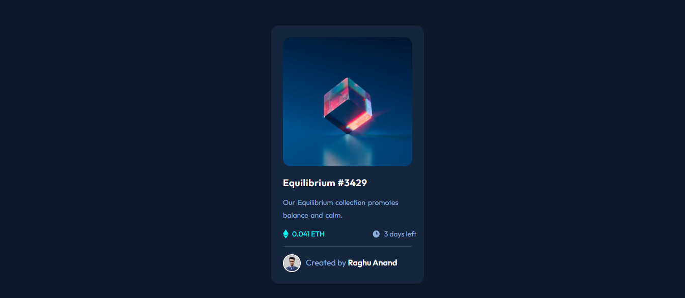

# Frontend Mentor - NFT preview card component solution

This is a solution to the [NFT preview card component challenge on Frontend Mentor](https://www.frontendmentor.io/challenges/nft-preview-card-component-SbdUL_w0U). Frontend Mentor challenges help you improve your coding skills by building realistic projects. 

## Table of contents

- [Overview](#overview)
  - [The challenge](#the-challenge)
  - [Screenshot](#screenshot)
  - [Links](#links)
- [My process](#my-process)
  - [Built with](#built-with)
  - [What I learned](#what-i-learned)
- [Author](#author)
- [Acknowledgments](#acknowledgments)

## Overview

### The challenge

- I faced the challenge in centering the avatar and credits.

### Screenshot




### Links

- Solution URL: [Add solution URL here](https://github.com/raghuaanand/30-Days-30-Projects/tree/main/11.%20NFT%20Preview%20Card)
- Live Site URL: [Add live site URL here](https://raghu-nft-preview-card.netlify.app/)

## My process

### Built with

- Semantic HTML5 markup
- CSS custom properties
- Flexbox
- CSS Grid
- Mobile-first workflow

### What I learned

I learned how to align by default block elements

I am adding the sinppets of code, how I styled the footer section in my project, see below:


```css
.footer{
  border-top: 1.5px solid var(--Very-dark-blue-line);
  display: flex;
  padding-top: 15px;
}
.avatar{
  max-width: 35px;
  border-radius: 50px;
  border: 2px solid white;
}
.credits{
  color: var(--Soft-blue);
  transform: translate(10px,6px);
}
strong{
  color: var(--White);
}
```


## Author
- Website - [Raghu Anand](https://raghuaanand.github.io/)
- Frontend Mentor - [@raghuaanand](https://www.frontendmentor.io/profile/raghuaanand)
- Twitter - [@raghuaanand](https://www.twitter.com/raghuaanand)

