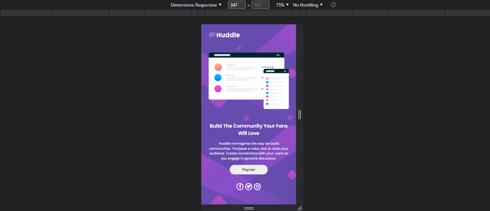

# Frontend Mentor - Huddle landing page with single introductory section solution

This is a solution to the [Huddle landing page with single introductory section challenge on Frontend Mentor](https://www.frontendmentor.io/challenges/huddle-landing-page-with-a-single-introductory-section-B_2Wvxgi0). Frontend Mentor challenges help you improve your coding skills by building realistic projects. 

## Table of contents

- [Overview](#overview)
  - [The challenge](#the-challenge)
  - [Screenshot](#screenshot)
  - [Links](#links)
- [My process](#my-process)
  - [Built with](#built-with)
- [Author](#author)

## Overview

### The challenge

Users should be able to:

- should make the landing page responsive to the screen size.

### Screenshot

### Links

- Solution URL: [Add solution URL here](https://github.com/raghuaanand/30-Days-30-Projects/tree/main/12.%20Landing%20Page)
- Live Site URL: [Add live site URL here](https://raghu-website-landing-page.netlify.app/)

## My process

### Built with

- Semantic HTML5 markup
- CSS custom properties
- Flexbox
- CSS Grid
- Mobile-first workflow
- Google Font
- Awesome font icon

## Author

- Website - [Raghu Anand](https://raghuaanand.github.io/)
- Frontend Mentor - [@raghuaanand](https://www.frontendmentor.io/profile/raghuaanand)
- Twitter - [@raghuaanand](https://www.twitter.com/raghuaanand)

